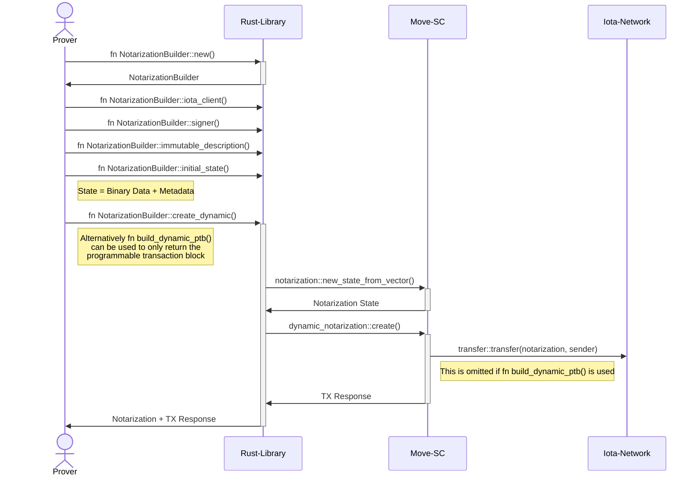
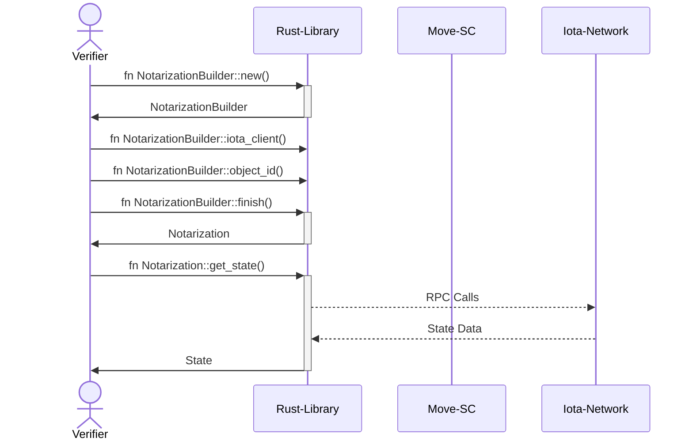
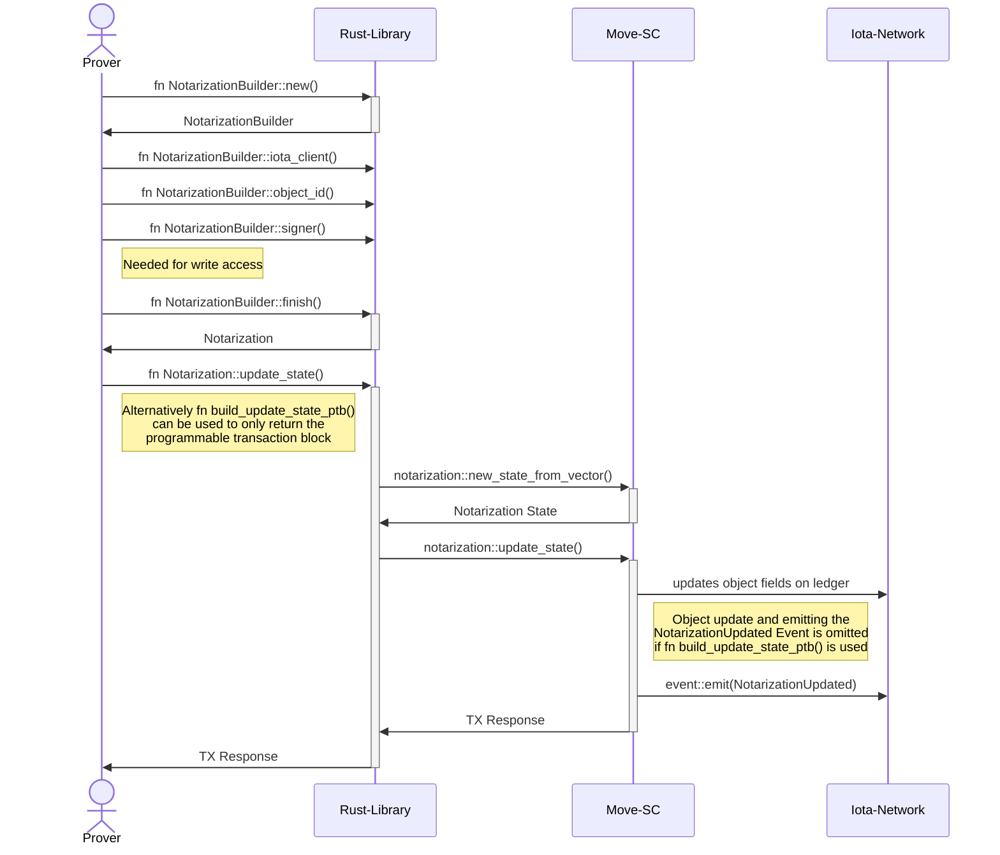

# IOTA Notarization

The Notarization Rust library provides a `NotarizationBuilder` that can be used to create Notarization objects on
the IOTA ledger or to use an already existing Notarization object. The NotarizationBuilder returns a Notarization struct
instance, which is mapped to the Notarization object on the ledger and can be used to interact with the object.

You can find the full IOTA Notarization documentation [here](https://docs.iota.org/developer/iota-notarization).

Following Notarization methods are currently provided:

- Dynamic Notarization
- Locked Notarization

These Notarization methods are implemented using a single Notarization Move object, stored on the IOTA Ledger.
The Method specific behavior is achieved via configuration of this object.

To minimize the need for config settings, the Notarization methods reduce the number of available configuration
parameters while using method specific fixed settings for several parameters, resulting in the typical method
specific behaviour. Here, Notarization methods can be seen as a prepared configuration sets to facilitate
Notarization usage for often needed use cases.

Here is an overview of the most important configuration parameters for each of these methods:

| Method  | Locking exists  | delete_lock*     | update_lock             | transfer_lock           |
| ------- | --------------- | ---------------- | ----------------------- | ----------------------- |
| Dynamic | Optional [conf] | None [static]    | None [static]           | Optional [conf]         |
| Locked  | Yes [static]    | Optional* [conf] | UntilDestroyed [static] | UntilDestroyed [static] |

Explanation of terms and symbols for the table above:

- [conf]: Configurable parameter.
- [static]: Fixed or static parameter.
- Optional:
  - Locks: The lock can be set to UnlockAt or UntilDestroyed.
  - Locking exists: If no locking is used, there will be no [`LockMetadata`] stored with the Notarization object.
    Otherwise [`LockMetadata`] will be created automatically.
- *: delete_lock can not be set to `UntilDestroyed`.

## Process Flows

The following workflows demonstrate how NotarizationBuilder and Notarization instances can be used to create, update and
destroy Notarization objects on the ledger.

### Dynamic Notarizations

A _Dynamic Notarization_ is created on the ledger using the `NotarizationBuilder::create_dynamic()` function.
To create a _Dynamic Notarization_, the following initial arguments need to be specified using the NotarizationBuilder
setter functions (The used terms can be found in the [glossary below](#glossary)):

- Initial State consisting of `Stored Data` and `State Metadata` that will be used to define the first version of the
  Notarization state.
- Optional `Immutable Description`
- Optional `Updateable Metadata`
- An optional boolean indicator if the Notarization shall be transferable

After the Notarization has been created, it can be updated using the `Notarization::update_state()` function and can be
destroyed using `Notarization::destroy()`.

#### Creating a new Dynamic Notarization on the Ledger

The following sequence diagram explains the interaction between the involved technical components and the `Prover` when a
_Dynamic Notarization_ is created on the ledger:

#### Fetching state data from a Notarization already existing on the ledger

The following sequence diagram explains the component interaction for `Verifiers` (or other parties) fetching the
`Latest State`:

#### Updating state data of a Notarization already existing on the ledger

The following sequence diagram shows the component interaction in case a `Prover` wants to update the `Latest State` of a
Notarization:

### Locked Notarizations

In general _Locked Notarizations_ are handled similar to _Dynamic Notarizations_. A _Locked Notarization_ is created on the
ledger using the `NotarizationBuilder::create_locked()` function.

To create a _Locked Notarization_ the following arguments need to be specified using the NotarizationBuilder setter
functions:

- all arguments needed to create a _Dynamic Notarization_
- Optional Delete Timelock

After the _Locked Notarization_ has been created - by design - the `Latest State` can not bee updated anymore.

The lifecycle of a _Locked Notarization_ can be described as:

- Create a Notarization object using the `NotarizationBuilder::create_locked()` function
- If a `Delete Timelock` has been used, wait at least until the time-lock has expired
- Destroy the Notarization object

As the `Latest State` of a _Locked Notarization_ can not be updated the lifecycle doesn’t include any update processes.

## Glossary

- `Original Data`: The document, file, or arbitrary data that is intended to be notarized. In _Dynamic Notarization_,
  typically only a representation (e.g., a hash or JSON) of this data is stored on-chain.
- `Stored Data`: The exact bytes currently held in the updatable ledger object. This represents the latest state of the
  data; each update completely overwrites the previous stored data.
- `Ledger Object`: A single, updatable on-chain object that holds the `Latest State` of the notarized data. It is
  identified by a unique ObjectId and is modified through update transactions.
- `Transfer Timelock`k: An optional time-locking period during which the `Ledger Object` can not be transfered.
- `Delete Timelock`: An optional time-locking period during which the Ledger Object can not be deleted.
- `State Metadata`: An optional text describing the `Stored Data`. For example, if document hashes of succeeding
  revisions of a document are stored as `Stored Data`, State Metadata can be used to describe the revision specifier of
  the document.
- `Latest State`: The most recent version of the `Stored Data` (and optionally theState Metadata) within the
  `Ledger Object`. In _Dynamic Notarization_, only this latest state is visible on-chain, as previous states are
  overwritten. As the `Stored Data` and optionally the `State Metadata` together build the `Latest State` they can only
  be updated together in one function call.
- `Storage Deposit`: IOTA tokens locked alongside the ledger object to secure its permanence on-chain. This deposit
  typically remains constant, unless the object's data size increases significantly.
- `Data Availability`: In _Dynamic Notarization_, the ledger exclusively retains the `Latest State` of the data. Older
  states are overwritten and thus are not available on-chain, ensuring that `Verifiers` always see only the latest
  version.
- `Prover`: The entity responsible for initiating update transactions to modify the `Ledger Object` with the
  `Latest State`.
- `Verifier`: The entity that retrieves and checks the `Latest State` from the `Ledger Object` to confirm the data’s
  immutability.
- `Immutable Description`: An arbitrary informational String that can be used for example to describe the purpose of the
  created _Dynamic Notarization_ object, how often it will be updated or other legally important or useful information.
  The `Immutable Description` is specified by the `Prover` at creation time and can not be updated after the Notarization
  abject has been created.
- `Creation Timestamp`: Indicates when the `Ledger Object` was initially created.
- `Immutable Metadata`: Consists of the `Immutable Description` and `Creation Timestamp`.
- `Updateable Metadata`: An arbitrary informational String that can be updated at any time by the `Prover` independently
  from the `Latest State`. Can be used to provide additional useful information that are subject to change from time to
  time.
- `State Version Count`: Numerical value incremented with each update of the `Latest State`.
- `Last State Change Time`: Indicates when the `Latest State` has been updated the last time.
- `Calculated Metadata`: Consists of the `State Version Count` and `Last State Change Time`
- `Notarized Record`: Some information owned by the `Prover` that describe and include notarized data, so that these data
  can be verified by a `Verifier`. In the context of the _Dynamic Notarization_ method, the latest version of subsequent
  versions of a `Notarized Record` is the `Latest State`.
